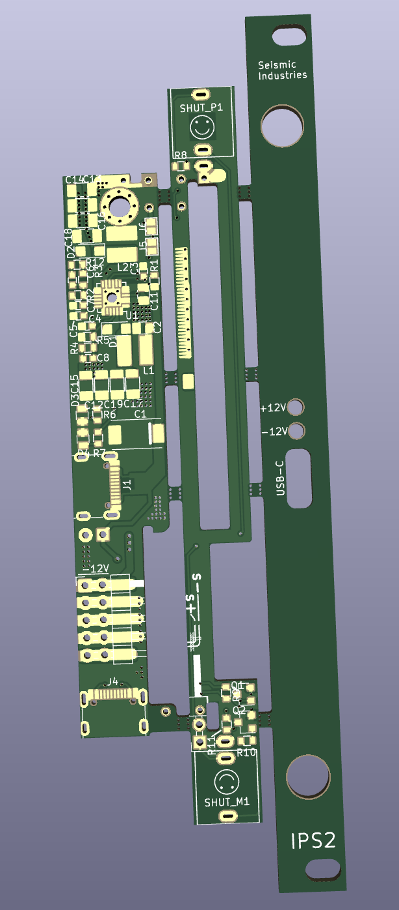
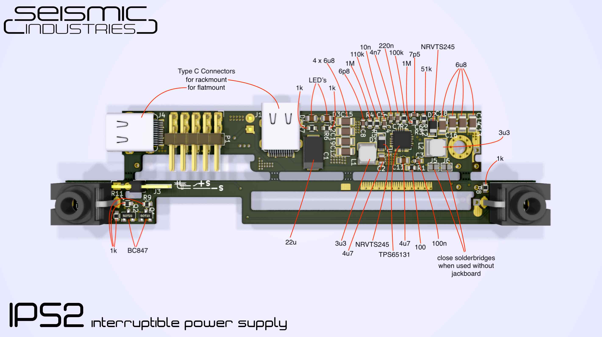

# IPS2

The infamous interruptible power supply is back version 2 with usbC and more mmpfh (700mA@12V / 500mA@-12V).

IPS is a 2HP opensource (cc-by-sa-nc) eurorack module. It’s a switched-mode power supply that converts the 5V power from any USB type C interface/charger into +12V/-12V for your modular synthesizer. This does not allow you to power big racks but can easily power up small to medium size systems (check powerconsumption with f.e. modulargrid.net)
You can also use the unit without frontpanel inside a case (no access to the SHUT inputs) if it has a power switch and a 5V input.

Unlike IPS1 this module is built around a monolytic IC which houses two independent regulators, the TPS65131 from TI. It still has the infamous shutdown inputs for the regulators, which are accessible thru two jacks on the frontpanel.
Quote from IPS1: “This gives you a very different approach to operate a connected module. By “proper” modulation of it’s own powersupply voltages any connected module(s) can operate then in a, let’s say:  “near death state”, which can create interesting effects.

DISCLAIMER:
The shutdown inputs are a very experimental feature for those who like to experiment on their own risk with reduced or chopped supply voltages for their modules/setup. We take no responibility for damage or the like. (should not occur, cause no inversion of voltage is possible, only reduction of voltage is possible)

In a glimpse:

- modern and fast 1.25MHz switching regulator from Texas Instruments deliver up to 700mA@12V and 500mA@-12V
- IPS mainboard can be mounted inside a case without frontpanel like a common PSU (flatmount, has 2nd location for USB C connector and also pads for wires)
- cheap – can be used with any USB type C charger
- it’s friggin tiny

In this fork, I've replaced the USB connectors to some more available on JLCPCB.

Also I've added a front-panel design that is connected to the PCB with break-tabs so they can
be easily manufactured in one run and separated. Components also have JLCPCB part numbers.

I/O:

- SHUT +12V deactivates the swiching regulator for the positive rail
- SHUT -12V deactivates the switching regulator for the negative rail
- internal 10 pin molex output header

Power Output:

- +12V 700mA / -12V 500mA (if incoming USB interface delivers it)

Dimensions:

- Width: 2 HP (10mm)
- Depth: 13mm

## License

CC-BY-SA-NC license

by seismic industries / 2019
